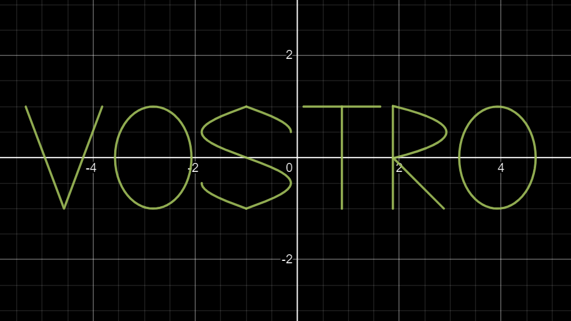

    

<h2>Предварительная установка</h2>

В случае отсутствия исполняемого файла установите <a href='https://www.freepascal.org'>fpc compiler</a> и скомпилируйте программу, прописав <code>make</code>

<h2>Начало работы</h2>

Находясь в каталоге программы, запустите исполняемый файл, прописав для

<ul>
    <li>UNIX: &nbsp;&nbsp;&nbsp;&nbsp;&nbsp;&nbsp;<code>./vostro &lt;параметры&gt;</code></li>
    <li>Windows: <code>vostro.exe &lt;параметры&gt;</code></li>
</ul>
<code>
    &lt;параметры&gt;</code> ::= <code>&lt;epsilon для площади&gt; &lt;epsilon для пересечений&gt; &lt;масштаб&gt;
</code>  

Задание №3 из МГУ от А.Н.Сальникова

<address>© 2024 Кирилл Кибизов</address>
